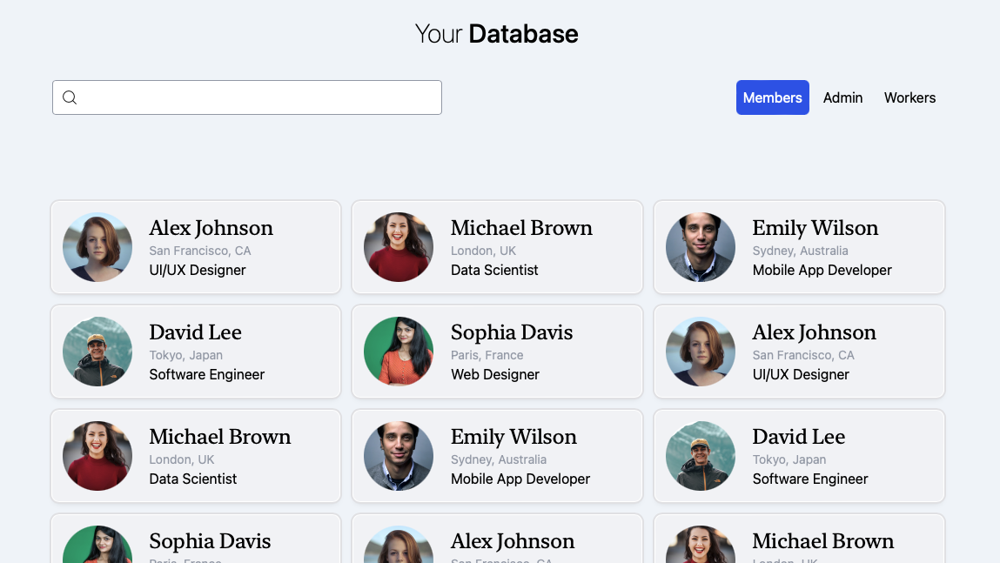

# TailwindCSS-Component: User List

This repository contains a sleek and responsive user list component designed with TailwindCSS.
It's ideal for applications that require displaying user profiles in a clean and organized manner.
The component features a searchable list interface, making it perfect for handling large sets of user data across various platforms.

## Features

- Responsive design that works seamlessly on both desktop and mobile devices.
- Search functionality to easily find specific users.
- User profiles with pictures and essential information displayed in an attractive layout.
- Utilizes TailwindCSS via Play CDN for easy integration without local setup.

## Preview

Desktop view:



Mobile view:


## Usage

To incorporate this user list component into your project, simply integrate the HTML and CSS from the `user-list.html` file found in this repository. Ensure you have the TailwindCSS CDN linked in your project if it is not already:

```html
<!-- TailwindCSS CDN for quick setup -->
<link href="https://cdn.tailwindcss.com" rel="stylesheet">
```

## Access

For a live demo of the user list component, visit:
